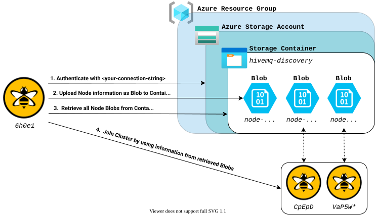

:azure-connection-string: https://learn.microsoft.com/en-us/azure/storage/common/storage-configure-connection-string
:hivemq-extension-downloads: https://github.com/hivemq/hivemq-azure-cluster-discovery-extension/releases/latest
:hivemq-cluster-discovery: https://www.hivemq.com/docs/latest/hivemq/cluster.html#discovery
:hivemq-support: http://www.hivemq.com/support/

= HiveMQ Azure Cluster Discovery Extension

image:https://img.shields.io/badge/Extension_Type-Integration-orange?style=for-the-badge[Extension Type]
image:https://img.shields.io/github/v/release/hivemq/hivemq-azure-cluster-discovery-extension?style=for-the-badge[GitHub release (latest by date),link=https://github.com/hivemq/hivemq-azure-cluster-discovery-extension/releases/latest]
image:https://img.shields.io/github/license/hivemq/hivemq-azure-cluster-discovery-extension?style=for-the-badge&color=brightgreen[GitHub,link=LICENSE]
image:https://img.shields.io/github/actions/workflow/status/hivemq/hivemq-azure-cluster-discovery-extension/check.yml?branch=master&style=for-the-badge[GitHub Workflow Status,link=https://github.com/hivemq/hivemq-azure-cluster-discovery-extension/actions/workflows/check.yml?query=branch%3Amaster]

== Prerequisites

* Java 17 or later

== Purpose

This HiveMQ extension allows your HiveMQ cluster nodes to discover each other dynamically by regularly exchanging their information via Azure Blobs in an Azure Blob Storage Container.

HiveMQ instances are added at runtime as soon as they become available by placing their information, on how to connect to them, to the configured Azure Storage Container.
The extension will regularly check the configured Azure Storage Container for files from other HiveMQ nodes.
Additionally, every broker updates its own file on a regular basis to prevent the file from expiring.

== Installation

* Download the extension from the {hivemq-extension-downloads}[GitHub releases page^].
* Copy the content of the zip file to the `extensions` folder of your HiveMQ nodes.
* Modify the `conf/config.properties` file for your needs.
* Change the {hivemq-cluster-discovery}[discovery mechanism^] of HiveMQ to `extension`.

== Configuration

The information each node writes into the container consists of an ip-address and a port.
The ip-address and port are taken from the `external-address` and `external-port` which is configured in the cluster `transport` (config.xml).
If they are not set, the `bind-address` and `bind-port` will be used.

The `conf/config.properties` can be reloaded during runtime.

=== General Configuration

|===
| Config name | Default value | Description

| connection-string
|
| The required connection string of your Azure Storage Account.
See the {azure-connection-string}[Azure documentation^] for more information.

| container-name
| hivemq-discovery
| The name of the Azure Storage Container in which the Blob for the discovery will be created in.
If the Container does not exist yet, it will be created by the extension.

| file-prefix
| hivemq-node-
| An optional file-prefix for the Blob to create, which holds the cluster node information for the discovery.
Do not omit this value if you reuse the specified container for other files.

| file-expiration
| 360
| Timeout in seconds after which the created Blob will be deleted by other nodes, if it was not updated in time.

| update-interval
| 180
| Interval in seconds in which the Blob will be updated.
Must be less than `file-expiration`.
|===

.Example Configuration
[source,properties]
----
connection-string=DefaultEndpointsProtocol=http;AccountName=devstoreaccount1;AccountKey=Eby8vdM02xNOcqFlqUwJPLlmEtlCDXJ1OUzFT50uSRZ6IFsuFq2UVErCz4I6tq/K1SZFPTOtr/KBHBeksoGMGw==;BlobEndpoint=http://172.17.0.1:10000/devstoreaccount1
container-name=hivemq-discovery
file-prefix=hivemq-node-
file-expiration=120
update-interval=60
----

== First Steps

* Create an Azure Storage Account.
* Get your Connection String for the Storage Account.
* Place the Connection String into the `conf/config.properties` file of your HiveMQ nodes.
* Start your HiveMQ nodes and verify the discovery.

== Need Help?

If you encounter any problems, we are happy to help.
The best place to get in contact is our {hivemq-support}[support^].

== Contributing

If you want to contribute to HiveMQ Azure Cluster Discovery Extension, see the link:CONTRIBUTING.md[contribution guidelines].

== License

HiveMQ Azure Cluster Discovery Extension is licensed under the `APACHE LICENSE, VERSION 2.0`.
A copy of the license can be found link:LICENSE[here].
